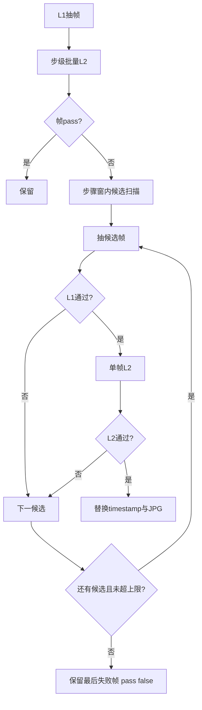

# 关键帧验收规则（Keyframe QA）

版本：v2.1 运行时（复刻参考对 + 步级 L1/L2）；**v2.2 步级 L2 失败重抽为设计稿，代码未实现**

适用：每次 run 在 `ffmpeg` 抽帧后自动执行；结果写入 `keyframe-qa.json`，并回写 `analysis.json` 中各 keyframe 的 `validation` 字段。

## 目标

保证关键帧**可用于后续跟练 / 图示 / 妆容复刻**，避免黑场、产品特写、无脸画面冒充步骤起止、部位细节或片尾成妆参考。

## 验收层级

### L1 文件与画面基础（必须通过，否则重抽）

| 检查项 | 规则 | 失败处理 |
|--------|------|----------|
| 文件存在 | `keyframes/` 下对应 `filename` 存在 | 重抽 |
| 体积极小 | 文件大小 ≥ **4 KB** | 重抽 |
| 分辨率 | 宽、高均 ≥ **320 px**（ffprobe） | 重抽 |
| 时间戳合法 | `timestamp_sec` 在 `[0, duration_sec]` | 修正或重抽 |

**分屏 crop**：从单帧裁出的半幅图仍须满足 **宽、高均 ≥ 320 px**；不足则放弃 split 策略，改 sequence 或 `tutorial_baseline` 回退。

**L1 重抽策略（已实现）**：在原时间戳 **±1.5 s** 内最多尝试 **3** 个候选（原时刻、+1.5s、−1.5s），仍失败则保留最后一帧但标记 L1 未通过。该层**仅**服务文件存在性 / 体积 / 分辨率。下文「L2 失败重抽」为规划能力，**当前运行时不会执行**。

### L2 语义验收 — 步级（Qwen 视觉，单步批量）

对每一步的所有关键帧 JPG，使用 **`qwen3.7-plus`** 一次 multimodal 调用（多图 + JSON 输出），输入：

- 步骤主类 `step_name` / `taxonomy.primary`
- `taxonomy.sub_steps`（若有）
- 每张图的 `role`、`label`、`index_in_step`

模型返回每张图：

| 字段 | 含义 |
|------|------|
| `has_face` | 是否出现可辨识人脸（含半脸、对镜自拍） |
| `face_sufficient` | 脸部占画面足够比例（非极小远景） |
| `region_match` | `makeup_detail` 时，画面是否聚焦 label/sub_step 对应区域 |
| `pass` | 综合是否通过 |
| `reason` | 简短中文原因 |

**按 role 的通过条件（steps[]）**

| role | 通过条件 |
|------|----------|
| `step_start_face` | `has_face` 且 `face_sufficient`；应为步骤开始时的**全脸或明显半脸**，非纯产品/文字卡 |
| `step_end_face` | 同 `step_start_face`，对应该步骤结束时刻 |
| `makeup_detail` | `has_face` 且 `region_match` 为 true；`label` 应优先为 [step-taxonomy.md](step-taxonomy.md) 中的 **sub_step 名** |

首轮用**整步多图一次**批量 L2。L2 失败后**当前实现**：保留帧、`validation.pass: false`，**不**进入窗内重抽。

### L2 失败重抽（步级，v2.2 设计 — 代码未实现）

> **状态**：规范已定，[`keyframes.py`](../../packages/video-parse/video_parse/keyframes.py) **尚未**写入 `l2_retry` / `l2_rescued`。Agent 与验收以「L2 失败即标失败」为准；下列规则供后续实现对照。

范围（实现后）：**仅**步级角色 `step_start_face` / `step_end_face` / `makeup_detail`。`replication_*` 与 Pair **不**因 L2 失败自动重抽（见下文复刻节）。

| 项 | 约定 |
|----|------|
| 触发 | 步级 L2（含 role 收紧）后 `validation.pass == false` |
| 搜索窗 | 该步 `time_range.start_sec`～`end_sec`；候选须 clamp 到 `[0, duration_sec]` |
| 步长 | **1.0 s** |
| 方向 | `step_end_face`：自 `end_sec` **向 start 回扫**；`step_start_face`：自 `start_sec` **向 end 前扫**；`makeup_detail`：自原 `timestamp_sec` 交替 ±1s、±2s… 且落在窗内 |
| 排除 | 跳过与**同一步内其他已通过帧**时间差 &lt; **0.5 s** 的候选，避免重复画面 |
| 单帧上限 | 每失败帧最多再试 **8** 个候选（不含首次原帧） |
| 验收顺序 | 每候选：ffmpeg 抽出 → L1 → **单帧** L2（同 role 通过条件）；通过则更新 `timestamp_sec`、覆盖同名 JPG、写最终 `validation` |
| 耗尽 | 保留最后一次候选（或原帧若从未换成功），`pass: false`，`reason` 保留失败原因 |

**`keyframe-qa.json` 字段（步级）**

- `items[]` 可选 `l2_retry`：
  - `attempts`：进入 L2 重抽后实际尝试的候选次数
  - `candidates_tried`：尝试过的时间戳（秒）列表
  - `replaced`：是否已用通过帧替换原抽帧
  - `final_timestamp_sec`：最终采用的时间戳
- `summary` 增加：
  - `l2_retried_frames`：进入过 L2 重抽的帧数
  - `l2_rescued`：重抽后变为 `pass: true` 的帧数
- `retried_extracts`：继续表示**抽帧次数合计**（含 L1 与 L2 重抽产生的每一次 extract）

实现时须同步 [keyframes.py](../../packages/video-parse/video_parse/keyframes.py) 与 [output-contract.md](output-contract.md)。**当前产物不含**上述 `l2_retry` / `l2_rescued` 字段。

### L2 语义验收 — 复刻参考（v2.1 / refs v1.2）

见 [makeup-replication-refs.md](makeup-replication-refs.md)。**主策略**为步骤边界：before = 时间序第一步 `step_start_face`；after = 时间序最后非 skipped 化妆主类步骤的结束全脸（`step_end_face` 或步末扫描）。片尾 hints 仅回退。

**单帧**（after / before **各自**调用；硬条件，不可省略）：

| role | 通过条件 |
|------|----------|
| `replication_after` | `has_face` 且 `face_sufficient`；**全妆完成展示**（非单部位特写、非产品/关注引导卡、**非对比素颜侧**）；`makeup_complete` 为 true |
| `replication_before` | `has_face` 且 `face_sufficient`；**素颜或明显更素**于成片（`makeup_minimal`）；非成妆展示 |

单帧 `validation.pass` 须同时满足 L1 与上表；**不得**仅因 L1 通过就写 `pass: true`。

**Pair L2**（一次 2 图：before 在前、after 在后）：

| 字段 | 含义 |
|------|------|
| `same_person` | 两张图是否为同一人 |
| `before_is_bareer` | before 是否明显更素 |
| `after_is_full_makeup` | after 是否为教程完成全妆 |
| `pass` | 三者均 true 且无严重遮挡/换脸 |
| `reason` | 简短中文 |

执行顺序：

1. after / before **各自**单帧 L2（硬条件）。
2. **仅当两侧单帧均 pass** 时再跑 Pair L2。
3. Pair 失败 → `pair_validation.pass: false`；**不**用 Pair 结果覆盖已失败的单帧 after/before。
4. **Pair 通过不能代替** after 的 `makeup_complete` 单帧判定。

写入 `analysis.makeup_replication_refs.pair_validation` 与 `keyframe-qa.json` → `replication_pair.pair_validation`。

**分屏单帧**（仅片尾回退路径）：先 L2 判定妆前/妆后各占哪一侧，再 crop；crop 后各自走单帧 L2。

复刻侧 L2 **不通过**：不删除文件；**不**自动窗内重抽；after 单帧或 Pair 失败时下游须拒用或人工复核。

### L3 汇总（写入 run）

- `keyframe-qa.json`：步级每帧（L1 + validation；**当前无** `l2_retry`）+ **`replication_pair`**（v2.1）
- `meta.json`：`keyframe_qa` 步级汇总（`total` / `passed` / `failed` / `retried_extracts` / 可选 `l2_skipped`；**当前无** `l2_retried_frames` / `l2_rescued`）；**`replication_refs`** 复刻对汇总
- `analysis.json`：步级 keyframe `validation` + **`makeup_replication_refs`**

## 与 taxonomy 的关系

- `makeup_detail.label` 生成时优先使用 `taxonomy.sub_steps` 中的名称；QA 时用 `label` + `sub_steps` 判断 `region_match`。
- **复刻参考对不属于 12 主类**，不写入 `steps[].taxonomy`。

## 非目标

- 人脸识别身份 ID、美颜程度打分
- 多人物场景下的自动选角（仅要求「有人脸且符合步骤/参考语义」）
- 复刻参考对的 L2 自动重抽（v2.2 未包含）

## Agent 维护说明

修改规则时同步更新：

1. 本文件
2. `packages/video-parse/video_parse/keyframes.py` 与 `replication_refs.py` 内 prompt 与阈值
3. [output-contract.md](output-contract.md) 与 [makeup-replication-refs.md](makeup-replication-refs.md)
