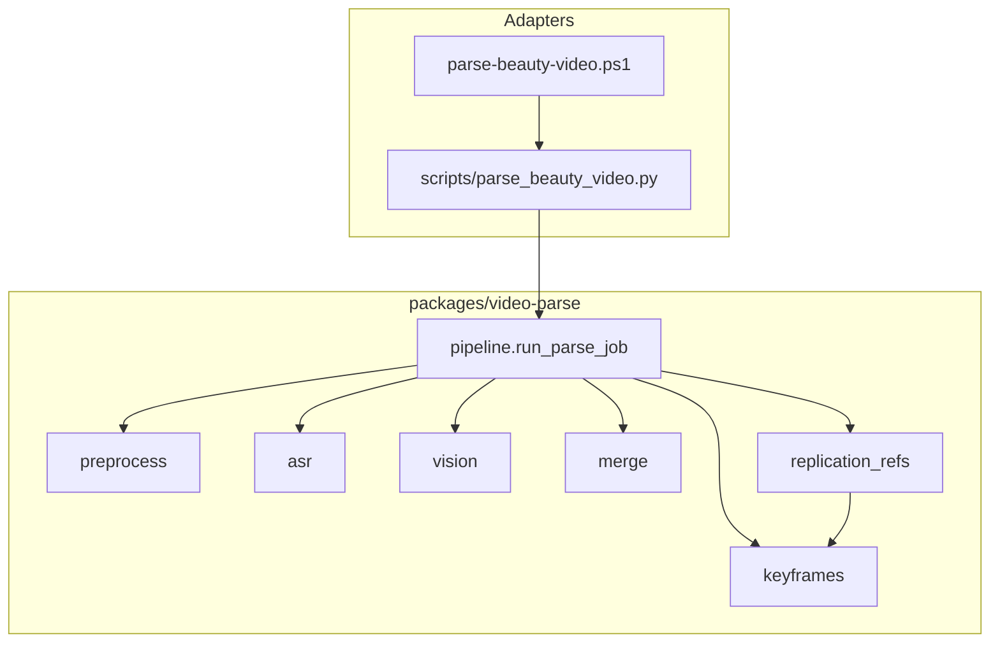

# 视频解析模块结构（可复用 Skill + 包）


目标：同一套能力可在 **Beauty Genius 仓库**、**Cursor Skill**、未来 **Web Worker** 中复用，而不绑定单一入口脚本。


## 设计原则


1. **Skill 管「怎么做」** — `skills/beauty-video-parse/*.md` 给 Agent 读；不含业务密钥。

2. **包管「跑什么」** — Python 包提供稳定 API；CLI / FastAPI / Celery 只是适配层。

3. **契约稳定** — [output-contract.md](output-contract.md) + JSON Schema（v2 / v2.1）；下游只依赖契约版本。

4. **宿主可注入** — 输出根目录、API Key、ffmpeg 路径、模型 id 由配置提供，不写死在 Skill 里。


## 目标目录布局（演进后）


```text

Beauty Genius/

├── skills/beauty-video-parse/

│   ├── SKILL.md

│   ├── makeup-replication-refs.md

│   ├── reference.md

│   ├── output-contract.md

│   └── ...

│

├── packages/video-parse/

│   └── video_parse/

│       ├── pipeline.py

│       ├── replication_refs.py      # 步骤边界 before/after（refs v1.2）

│       ├── keyframes.py

│       └── schemas/

│           ├── beauty_video_analysis.v2.json

│           └── beauty_video_analysis.v2.1.json

```


## 模块边界





| 模块 | 职责 | 禁止 |

|------|------|------|

| `replication_refs` | 首步 start / 末化妆步 end 选帧、写 `makeup_replication_refs`、单帧+Pair L2；片尾仅回退 | 修改 12 类 taxonomy |

| `keyframes` | 步级抽帧、L1/L2（L1 ±1.5s 重试已落地；**L2 窗内重抽 v2.2 未实现**） | 改 vision 步骤 prompt |

| `pipeline` | 编排；**一次** schema validate；**阶段进度**回调/打印 | UI / HTTP |


## 公开 API


`run_parse_job(..., config=ParseConfig(..., enable_replication_refs=True))`


`ParseConfig` 另含：`skill_dir`、`mode`（`full`|`fast`）、`enable_keyframe_qa`、**`enable_replication_refs`**。

CLI：`--mode full|fast`（`fast` ⇒ 跳过 L2 关键帧 QA）；`--skip-keyframe-qa` 与之叠加。


## 实现状态（维护时更新）


| 项 | 状态 |

|----|------|

| Skill 文档 v2.1 + 复刻参考 | **refs v1.2** 步骤边界主策略 [makeup-replication-refs.md](makeup-replication-refs.md)；**代码已实现** `replication_refs.py` |

| Skill 步级 L2 失败重抽（v2.2） | **设计稿**见 [keyframe-validation.md](keyframe-validation.md)；**运行时未启用**（`keyframes.py` 待做） |

| Skill CLI 阶段进度 `[n/10]` | **已实现**：`ParseConfig.on_progress` + CLI stderr；`--quiet` / `BEAUTY_PARSE_QUIET=1` |

| CLI `--mode full\|fast` | **已实现**：`fast` 跳过 L2 关键帧 QA（仍 L1）；`meta.mode` |

| `packages/video-parse` | `run_parse_job`、步级 QA（尚无 L2 窗内重抽）、**replication_refs v1.2**（首步 start / 末化妆步 end + 片尾回退）、schema v2.1、**阶段进度回调** |

| `scripts/parse_beauty_video.py` | 薄 CLI；`--skip-replication-refs`；**`--quiet` / 阶段进度** |

| Web Worker / 上传 API | 未开始 |

| Schema | v2（无复刻）/ **v2.1**（含 `makeup_replication_refs`）；`keyframe-qa` 新字段不 bump analysis schema |


## Skill 与代码的关系


| 层级 | 路径 | 读者 |

|------|------|------|

| Skill 入口 | `SKILL.md` | Cursor Agent |

| 复刻规范 | `makeup-replication-refs.md` | Agent / 复刻下游 |

| 实现 | `packages/video-parse/` | 运行时 |


